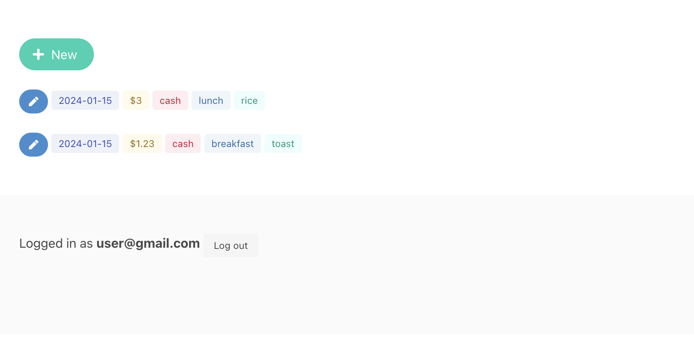
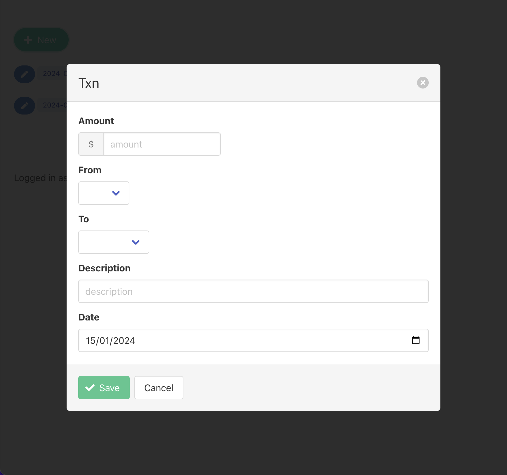
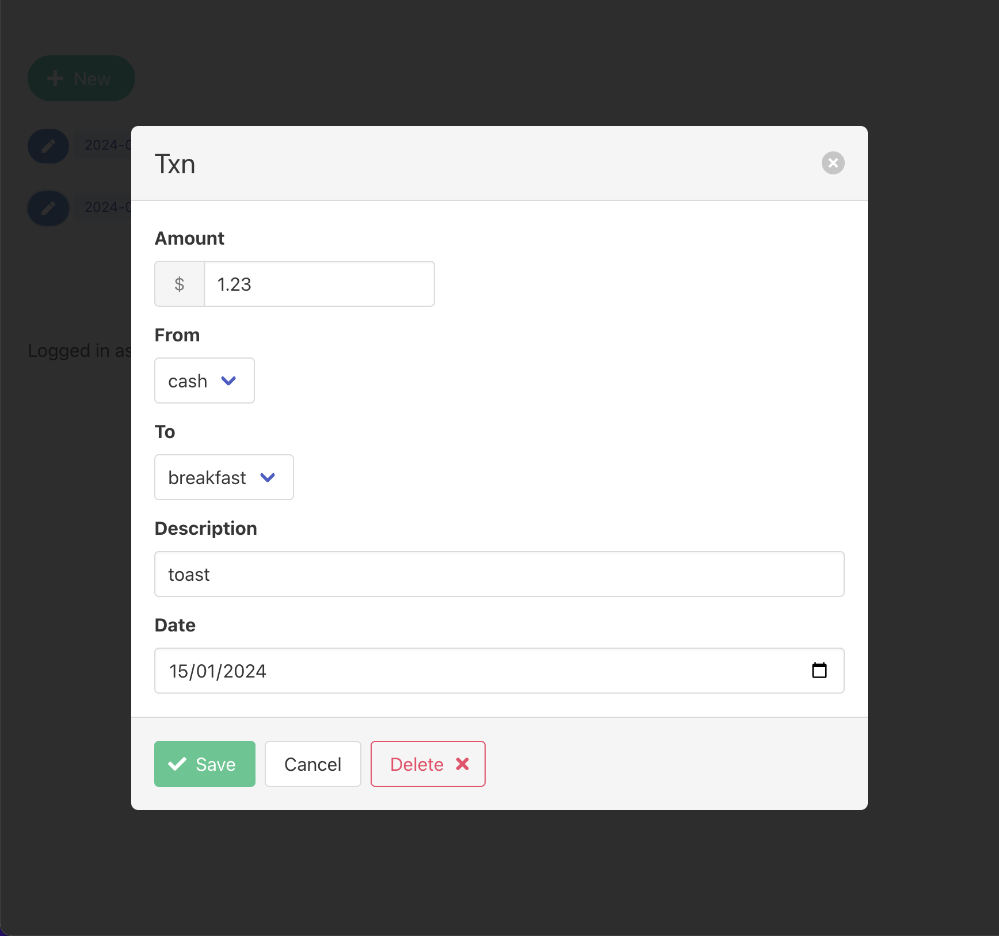

# Txn (Firebase + Svelte)





## Getting started

To develop:
```sh
$ cd hosting
hosting $ npm i
hosting $ npm run dev
```

To deploy:
```sh
hosting $ npx firebase deploy
```

## Troubleshoot

### Error when deploy

```
txn-firebase-svelte/hosting
❯ npx firebase deploy

Error: Request to https://firebasehosting.googleapis.com/v1beta1/projects/txns-ec814/sites?pageToken=&pageSize=10 had HTTP Error: 401, Request had invalid authentication credentials. Expected OAuth 2 ac
cess token, login cookie or other valid authentication credential. See https://developers.google.com/identity/sign-in/web/devconsole-project.
```

https://stackoverflow.com/questions/52891500/http-error-401-while-setting-up-firebase-cloud-functions-for-android-project

## References

- [Add data to Cloud Firestore](https://firebase.google.com/docs/firestore/manage-data/add-data)
- [Svelte](https://svelte.dev)
- [Bulma](https://bulma.io)
